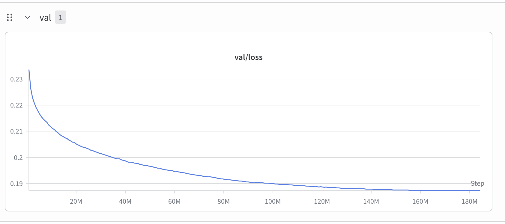

# Piccolo

A ~300M parameter decoder-only transformer pretrained from scratch on Italian text (CulturaX), then fine-tuned on Italian instruction data (Alpaca GPT-4 Italian). The architecture is modern but conventional: GQA, SwiGLU, RoPE, RMSNorm, tied embeddings. Everything is implemented in plain PyTorch — no HuggingFace Transformers.

## Architecture

| Hyperparameter | Value   |
|----------------|---------|
| Parameters     | ~300M   |
| Layers         | 14      |
| Embedding dim  | 1024    |
| Query heads    | 16      |
| KV heads       | 4       |
| FFN hidden dim | 3750    |
| Context length | 2048    |
| Vocabulary     | 100,277 |
| Dropout        | 0.1     |

**Attention.** Grouped Query Attention (4 KV heads, each shared across 4 query heads) via `F.scaled_dot_product_attention(..., enable_gqa=True)`, which dispatches to FlashAttention when available. KV-cache is supported for autoregressive inference.

**FFN.** SwiGLU: a single fused projection to `2 × ffn_hidden_dim`, chunked into two halves, then `SiLU(x1) * x2` projected back to `embedding_dim`.

**Position encoding.** RoPE with interleaved even/odd rotation (the original Su et al. 2022 formulation). This differs from the half-split convention used in LLaMA/GPT-NeoX — both are valid RoPE formulations, but weights trained with one are not compatible with the other.

**Loss.** Chunked cross-entropy: hidden states are projected to logits in chunks of 1024 tokens to avoid materializing the full `(B×T, vocab_size)` tensor on the GPU.

**Normalization.** Pre-norm RMSNorm with no mean subtraction and no bias.

**Embeddings.** Input and output embeddings are tied. Initialized from `N(0, 1/√D)`.

## Training

**Pretraining** was run on a single A100 40GB for one epoch over a CulturaX Italian subset. Effective batch size: 18 sequences × 18 gradient accumulation steps × 2048 tokens ≈ 664K tokens per optimizer step, for 8906 steps total (~5.9B tokens). AdamW with lr 3e-4 decaying cosinely to 3e-5 (500 warmup steps), weight decay 0.01, grad norm clip 1.0. `torch.compile` enabled, gradient checkpointing off.

**SFT** was run for 2 epochs on Alpaca GPT-4 Italian. Initialized from the pretrained checkpoint. lr 2e-5 decaying to 0 (no warmup), weight decay 0.1, same batch size, no gradient accumulation.

### Pretraining validation loss


Validation loss decreases steadily across training with no signs of divergence or instability.

### SFT validation loss



Validation loss decreases across both epochs with the expected steeper drop in the first.

## Examples and limitations

The SFT model follows simple conversational instructions reasonably well for its size. Outputs are in Italian.

**Working well — common knowledge:**
```
Human: Qual è la capitale d'Italia?
Model: La capitale d'Italia è Roma.
```

**Failing — less common facts, hallucination and self-contradiction:**
```
Human: Qual è la capitale del Portogallo?
Model: La capitale del Portogallo è Madrid.

Human: Ma non è Lisbona?
Model: Hai ragione, mi scuso. La capitale del Portogallo è Lisbona.
```

**Failing — repetition on long-form generation:**
```
Human: Dimmi 10 piatti tipici della cucina giapponese.
Model: 1. Sushi 2. Ramen 3. Sushi 4. Ramen 5. Sushi 6. Tempura 7. Sushi 8. Ramen 9. Sushi 10. Sushi
```

These are expected failure modes for a 300M model trained this way, not bugs.

**Known limitations:**

- **No loss masking on SFT.** Cross-entropy is computed over the full sequence including the instruction tokens, not just the model response. This is a deliberate tradeoff — simpler training at the cost of some training efficiency. See the [original InstructGPT paper](https://arxiv.org/abs/2203.02155) for context on why masking matters.

- **No multi-turn context in chat.** The `chat.py` script resets KV-cache and token history on every turn. The SFT dataset contains only single-turn examples, so the model was never trained to handle context carried across turns.

- **RoPE position encoding past the context window.** When a single generation run exceeds the model's context length (2048 tokens), the KV-cache is truncated but the RoPE offset is derived from the cache length, not the absolute token position. Beyond the context window the positional encoding is wrong. Quality degrades silently rather than erroring.

## Reproducing the training

### 1. Environment

```bash
pip install -r requirements.txt
```

Requires Python 3.10+ and PyTorch 2.10+. Training was done with CUDA; CPU is supported for testing but not practical for full runs.

### 2. Download and tokenize the pretraining dataset

CulturaX is gated on HuggingFace — you need an accepted-terms account and a token.

```bash
python -m src.utils.download_dataset \
    --dataset-type pretraining \
    --token <HF_TOKEN> \
    --max-files <N> \
    --output-dir data/raw_text
```

This downloads `N` randomly sampled Italian parquet files from [uonlp/CulturaX](https://huggingface.co/datasets/uonlp/CulturaX) into `data/raw_text/CulturaX/`. Then tokenize:

```bash
python -m src.utils.tokenize_pretraining_dataset \
    --data-dir data/raw_text \
    --output-dir data/raw_text_tokenized \
    --encoding cl100k_base \
    --train-split 0.9 \
    --seed 42
```

This produces `data/raw_text_tokenized/train.bin`, `val.bin`, and `metadata.json`. The tokenizer is tiktoken `cl100k_base` (same encoding as GPT-4, vocabulary size 100,277). Tokens are stored as `uint32` in flat binary files.

### 3. Pretraining

```bash
python -m src.train --config configs/training.yaml --training-type pretraining
```

Checkpoints are saved to `checkpoints/` after every validation run. The training config at `configs/training.yaml` targets 8906 optimizer steps; adjust `max_iterations` to change this. Set `wandb.enabled: false` if you are not using Weights & Biases.

### 4. Download and tokenize the SFT dataset

```bash
python -m src.utils.download_dataset \
    --dataset-type sft \
    --token <HF_TOKEN> \
    --max-files <N> \
    --output-dir data/conversational
```

Downloads files from [FreedomIntelligence/alpaca-gpt4-italian](https://huggingface.co/datasets/FreedomIntelligence/alpaca-gpt4-italian) into `data/conversational/alpaca-gpt4-italian/`. Then tokenize:

```bash
python -m src.utils.tokenize_sft_dataset \
    --input data/conversational/alpaca-gpt4-italian/alpaca-gpt4-italian.json \
    --output-dir data/conversational_tokenized \
    --sequence-length 2048 \
    --train-split 0.9 \
    --seed 42
```

SFT samples are stored with per-sample offset arrays (`train_offsets.npy`, `val_offsets.npy`) rather than a flat stream, since sample lengths vary.

### 5. SFT

Edit `configs/finetuning.yaml` and set `init_from` to the pretrained checkpoint you want to start from (e.g. `./checkpoints/checkpoint_best.pt`), then:

```bash
python -m src.train --config configs/finetuning.yaml --training-type sft
```

Checkpoints are saved to `checkpoints/finetune/`.

### 6. Generation and chat

**Open-ended generation** (prompts the model for a completion):

```bash
python -m src.generate \
    --checkpoint checkpoints/checkpoint_best.pt \
    --config configs/training.yaml \
    --max-new-tokens 200 \
    --temperature 0.8 \
    --top-k 50 \
    --top-p 0.95 \
    --repetition-penalty 1.2
```

**Chat** (wraps input in `Human: ... Model:` format, expects a SFT checkpoint):

```bash
python -m src.chat \
    --checkpoint checkpoints/finetune/checkpoint_best.pt \
    --config configs/training.yaml \
    --max-new-tokens 512 \
    --temperature 0.8 \
    --top-k 50 \
    --top-p 0.95 \
    --repetition-penalty 1.2
```

Sampling defaults to temperature 0.3, top-k disabled, top-p disabled, no repetition penalty. Set `--temperature 0` for greedy decoding.

## Repo structure

```
configs/        model, pretraining, and SFT configs
src/            model, training loop, dataset, tokenizer, generation/chat scripts
src/utils/      dataset download/tokenization, sampling, profiling utilities
test/           integration tests for training loop and LR schedule
```
